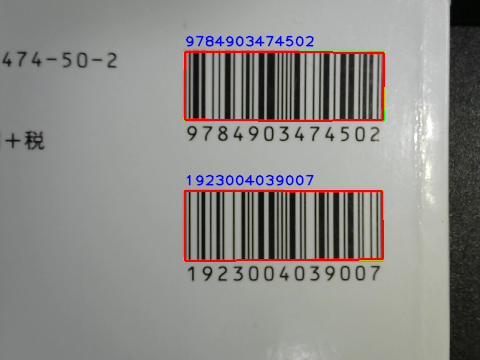

# barcode

read & show barcode

## Hardware
C270n HD WEBCAM (logitech/logicool)
## Dependencies

```sh
sudo apt install libzbar0
pip install opencv-python numpy pyzbar
```

## Usage

```sh
python barcode.py
```

## Examples


